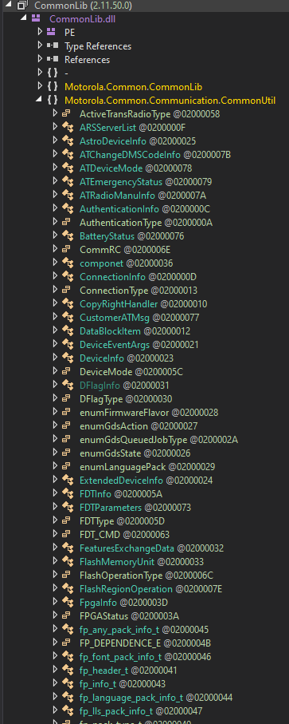
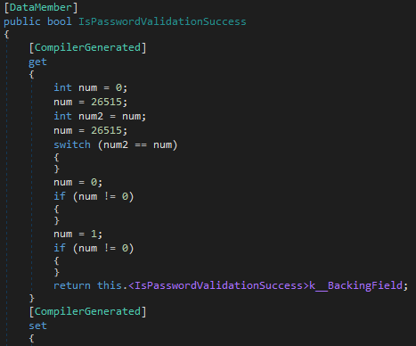
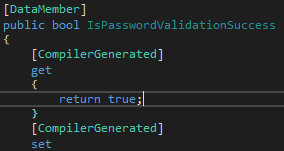

# Motorola CPS Password Bypass Patch

These instructions will walk you through how to patch Motorola CPS 16.0.828.0 to bypass all codeplug password restrictions.
It may work for other versions but hasn't been tested.

## Pre-Requisite Requirements
Install dnSpy from [https://github.com/dnSpy/dnSpy](https://github.com/dnSpy/dnSpy)

Install Motorola's CPS 16.0.828.0 from their website.

## Patching
Open dnSpy and use it to open C:\Program Files (x86)\Motorola CPS\CommonLib.dll
Double click PasswordStatus under CommonLib -> CommonLib.dll -> Motorola.Common.Communication.CommonUtil -> PasswordStatus (listing is shown below but is truncated)

Scroll down to IsPasswordValidationSuccess (function shown below)

Right click and press "Edit Method (C#)"

Replace the getter method with "return true;" (to match the function shown below)

Press "Compile"

Press "File" in the top left and then "Save All"

After following the prompts, start Motorola CPS and connect your radio. When prompted for a password enter anything and press ok and all checks will be bypassed.
